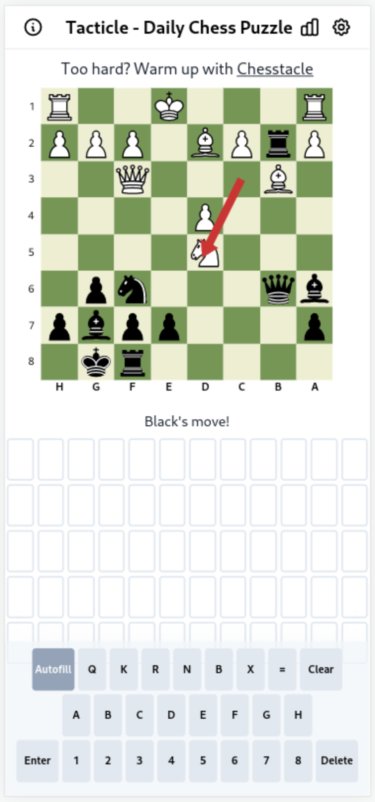
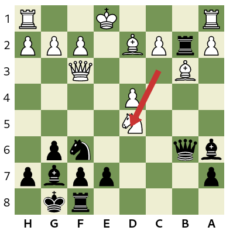

## Motivation

I'm an okay chess player and React developer, and I wanted to combine the two with my love of Wordle. I played [Chessle](https://jackli.gg/chessle/), but wasn't too impressed. Openings felt so arbitrary, that it just wasn't fun. It was like solving the wordle in a foreign language.

## Idea

How could we take chess "tactical" puzzles, and turn them into a Wordle variant? A chess keyboard is a neccessity - I know notation pretty well, but struggle to process it quickly. After a week or two of work, I think I'm pretty close.



## Starting Points

The most important thing is finding a good Wordle clone. I didn't want to have to make it pretty, I am bad at that!

[cwackerfuss/react-wordle](https://github.com/cwackerfuss/react-wordle) is outstanding. It is written in React with Tailwind CSS, which I like. The setup guide is pretty straightforward, and it deployed to Netlify first try.

If you are building a regular Wordle clone, stop here. Go to [/src/constants](https://github.com/cwackerfuss/react-wordle/tree/main/src/constants) and edit to your heart's content. The grid will expand or contract to fit different word sizes and max guesses. Set the settings, change the wordlist(s), buy a domain name because you're done!

If you play with the mechanics of the game (Mostly in `App.tsx`), make sure you update the information modal too.

## Chess Starting Points

I need three major things to make this site work - A chessboard, a way to track a chess game, and a bunch of chess puzzles.

### Chess Board

I used [react-chessboard](https://github.com/Clariity/react-chessboard). Autosizing was a little difficult, I had to use `useRef` to get the size of a container to scale the board to. It does not support `100%` width out of the box. Overall a solid place to start. I built the square notation in a grid surrounding the board, since I couldn't overwrite the letters and numbers CSS.

The board spans the middle of a 9x10 grid, the right column existing just to get spacing right.



### Chess Game

Here is where it gets weird. I used [chess.js] to load the puzzle positions, and track moves. chess.js uses update methods to change the game, which doesn't play great with React. `react-chessboard` solves that problem with a `safeGameMutate` function, which I used:

```js
  function safeGameMutate(modify: (x: ChessInstance) => void) {
    // A 'functional' state update, which applys the function inside setGame to the old state
    setGame((g) => {
      const update = { ...g }
      modify(update)
      return update
    })
  }

  //Then to update the game, in this case backing up a move:
  safeGameMutate((g) => {
        g.undo()
      })
```

Which took a long time to figure out! Make sure to disable [React Strict Mode](/why-react-functions-run-twice/) or you'll get updates to the game twice while developing if the update is valid. In my case I had a position where Qxe6 was valid twice in a row, and the app would auto-move it! Unfortunately, I can't find a way to make `chess.js` play nice with Strict Mode.

### Puzzles!

[Lichess](https://lichess.org) to the rescue! I used the [Lichess Open Puzzle Database](https://database.lichess.org/#puzzles), available as a csv, which I read into Python using pandas. I selected the first thousand puzzles rated over 1800, with a 100% rating, and more than a thousand plays. It came out to less than 150kb, which I am comfortable loading!

## Bonus: Chess Move Regex

When a user enters a move, I want the chess board to reflect that. To accomplish that, I need to find when an entry *could* be a move, then use `chess.js` to actually try the move. On [tacticle](https://tacticle.co) I used all uppercase letters, but this is how it works:

`const moveRegex =/([NBRQK])?([A-H])?([1-8])?(X)?([A-H][1-8])(=[NBRQK])?|O-O(-O)?/`

Then I use `moveRegex.test(move)` to see if it's valid yet! `moveRegex.match` is used for autofill.

Looking for a daily chess puzzle? Give [tacticle](https://tacticle.co) a shot and tell me what you think!
